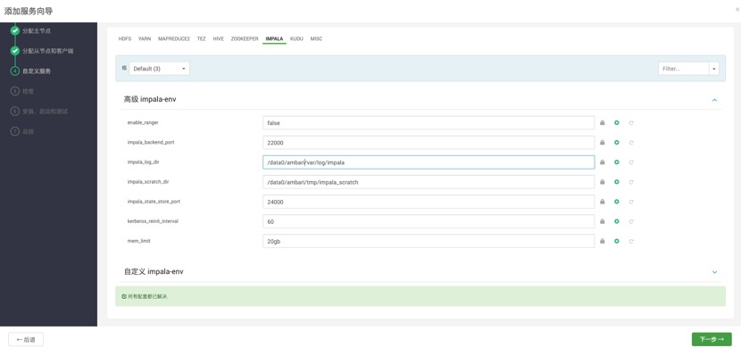
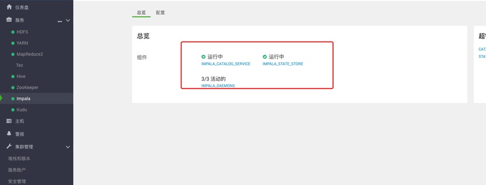

ambari集成impala组件
===
## 实现目标
当前最新ambari版本2.7.5.0及HDP3.1.5.0已不再发布维护和更新，由cloudera公司发布的CDP替代，CDP属于收费项目，因此推出基于ambari服务管理平台的impala服务组件。
本项目测试使用的ambari的版本为2.7.3和HDP3.1.4

https://archive.cloudera.com/p/cdh6/6.3.2

https://archive.cloudera.com/p/ambari/2.x/2.7.4.0/centos7/ambari-2.7.4.0-centos7.tar.gz


https://archive.cloudera.com/p/HDP/3.x/3.1.4.0/centos7/HDP-3.1.4.0-centos7-rpm.tar.gz

https://archive.cloudera.com/p/HDP-GPL/3.x/3.1.4.0/centos7/HDP-GPL-3.1.4.0-centos7-gpl.tar.gz


https://archive.cloudera.com/p/HDP-UTILS/1.1.0.22/repos/centos7/HDP-UTILS-1.1.0.22-centos7.tar.gz


## 关联项目
* [CDH KUDU on ambari](https://github.com/ligaopeng/ambari-kudu-service)
## 安装前准备
#### 1.配置cdh6镜像源：

CDH6镜像源：
```shell
# cdh6适配kudu版本为cdh-impala3.2.0
echo "[cloudera-cdh6.3.2]
# Packages for Cloudera's Distribution for Hadoop, Version 6.3.2, on RedHat or CentOS 7 x86_64
name=Cloudera's Distribution for Hadoop, Version 5
baseurl=https://archive.cloudera.com/cdh6/6.3.2/redhat7/yum/
gpgkey =https://archive.cloudera.com/cdh6/6.3.2/redhat7/yum/RPM-GPG-KEY-cloudera    
gpgcheck = 1" > /etc/yum.repos.d/cloudera-cdh6.3.2.repo
```
*无网络环境或网络环境差的情况下，可以将cdh6镜像源制作成本地镜像源进行安装*

使用httpd

```shell
vim /etc/yum.repos.d/cdh6.repo

#VERSION_NUMBER=2.7.4.0-118
[cdh6-3.2.0]
name=cdh6 Version - cdh6-3.2.0
baseurl=http://jq1:8099/cdh6/yum/
gpgcheck=1
gpgkey=http://jq1:8099/cdh6/yum/RPM-GPG-KEY-cloudera
enabled=1
priority=1
autorefresh=0

```

本地源所需rpm文件,下载地址为https://archive.cloudera.com/cdh6/6.3.2/redhat7/yum/

```shell
└── yum
    ├── repodata
    │   ├── 3224703272392229e02b46c2ef95286e92cce148a07c04752bcfe98870bfd675-primary.sqlite.bz2
    │   ├── 4526a7a317692d4c0de084f217193070a78b6b6e0013044b66dca3f5911a7053-filelists.xml.gz
    │   ├── 4f1d5a908a6b4fd79988109121695168a65ef0846f178bbf32dc99f92c7cef36-filelists.sqlite.bz2
    │   ├── 60fad47e7a1f5dc0769fa02df8a8bbb3703afbfd8748ada66a4eb27ff77572f8-other.sqlite.bz2
    │   ├── 9554b60409a425c25954a95755e77747be8299d113940fbf0712a31579f79146-other.xml.gz
    │   ├── cb6c5f61bfc4d0dca26d9ed6758b93802404ce4e0e5daaeaa98346bb6864b312-primary.xml.gz
    │   ├── repomd.xml
    │   ├── repomd.xml.asc
    │   ├── repomd.xml.key
    │   └── RPMS
    │       └── x86_64
    ├── RPM-GPG-KEY-cloudera
    └── RPMS
        ├── noarch
        │   ├── avro-doc-1.8.2+cdh6.3.2-1605554.el7.noarch.rpm
        │   ├── avro-libs-1.8.2+cdh6.3.2-1605554.el7.noarch.rpm
        │   ├── avro-tools-1.8.2+cdh6.3.2-1605554.el7.noarch.rpm
        │   ├── bigtop-utils-0.7.0+cdh6.3.2-1605554.el7.noarch.rpm
        │   ├── hbase-solr-1.5+cdh6.3.2-1605554.el7.noarch.rpm
        │   ├── hbase-solr-doc-1.5+cdh6.3.2-1605554.el7.noarch.rpm
        │   ├── hbase-solr-indexer-1.5+cdh6.3.2-1605554.el7.noarch.rpm
        │   ├── parquet-1.9.0+cdh6.3.2-1605554.el7.noarch.rpm
        │   ├── parquet-format-2.4.0+cdh6.3.2-1605554.el7.noarch.rpm
        │   ├── sentry-2.1.0+cdh6.3.2-1605554.el7.noarch.rpm
        │   ├── sentry-hdfs-plugin-2.1.0+cdh6.3.2-1605554.el7.noarch.rpm
        │   ├── sentry-store-2.1.0+cdh6.3.2-1605554.el7.noarch.rpm
        │   ├── solr-7.4.0+cdh6.3.2-1605554.el7.noarch.rpm
        │   ├── solr-crunch-1.0.0+cdh6.3.2-1605554.el7.noarch.rpm
        │   ├── solr-doc-7.4.0+cdh6.3.2-1605554.el7.noarch.rpm
        │   ├── solr-mapreduce-1.0.0+cdh6.3.2-1605554.el7.noarch.rpm
        │   ├── solr-server-7.4.0+cdh6.3.2-1605554.el7.noarch.rpm
        │   └── wget-log
        └── x86_64
            ├── hbase-2.1.0+cdh6.3.2-1605554.el7.x86_64.rpm
            ├── impala-3.2.0+cdh6.3.2-1605554.el7.x86_64.rpm
            ├── impala-catalog-3.2.0+cdh6.3.2-1605554.el7.x86_64.rpm
            ├── impala-debuginfo-3.2.0+cdh6.3.2-1605554.el7.x86_64.rpm
            ├── impala-server-3.2.0+cdh6.3.2-1605554.el7.x86_64.rpm
            ├── impala-shell-3.2.0+cdh6.3.2-1605554.el7.x86_64.rpm
            ├── impala-state-store-3.2.0+cdh6.3.2-1605554.el7.x86_64.rpm
            ├── impala-udf-devel-3.2.0+cdh6.3.2-1605554.el7.x86_64.rpm
            ├── kudu-1.10.0+cdh6.3.2-1605554.el7.x86_64.rpm
            ├── kudu-client0-1.10.0+cdh6.3.2-1605554.el7.x86_64.rpm
            ├── kudu-client-devel-1.10.0+cdh6.3.2-1605554.el7.x86_64.rpm
            ├── kudu-debuginfo-1.10.0+cdh6.3.2-1605554.el7.x86_64.rpm
            ├── kudu-master-1.10.0+cdh6.3.2-1605554.el7.x86_64.rpm
            └── kudu-tserver-1.10.0+cdh6.3.2-1605554.el7.x86_64.rpm

```

## 安装步骤

#### 1.查看当前HDP版本（ambari-server节点）
```shell
VERSION=`hdp-select status hadoop-client | sed 's/hadoop-client - \([0-9]\.[0-9]\).*/\1/'`
echo $VERSION
```
#### 2.下载并解压release版本插件包（ambari-server节点）
```shell
git clone git@github.com:ligaopeng/ambari-impala-service.git /var/lib/ambari-server/resources/stacks/HDP/$VERSION/services/IMPALA
```
#### 3.重启ambari-server
```shell
ambari-server restart
```
#### 4.修改配置'

在所有节点上执行

```shell
mkdir /var/run/hdfs-sockets/
chmod -R 775 /var/run/hdfs-sockets/
```
在ambari管理界面上设置

* hdfs-site.xml
```xml
<property>
    <name>dfs.block.local-path-access.user</name>
    <value>impala</value>
</property>
<property>
    <name>dfs.client.read.shortcircuit</name>
    <value>true</value>
</property>
<property>
    <name>dfs.domain.socket.path</name>
    <value>/var/run/hdfs-sockets/dn_PORT</value>
</property>
<property>
    <name>dfs.client.file-block-storage-locations.timeout.millis</name>
    <value>10000</value>
</property>
<property>
    <name>dfs.datanode.hdfs-blocks-metadata.enabled</name>
    <value>true</value>
</property>
```


* hive-site.xml
```xml
<property>
    <name>datanucleus.schema.autoCreateAll</name>
    <value>true</value>
</property>
```

安装过程有可能报错

中间发生一次报错信息：

Traceback (most recent call last):
  File "/var/lib/ambari-agent/cache/stack-hooks/before-ANY/scripts/hook.py", line 38, in <module>
    BeforeAnyHook().execute()
  File "/usr/lib/ambari-agent/lib/resource_management/libraries/script/script.py", line 352, in execute
    method(env)
  File "/var/lib/ambari-agent/cache/stack-hooks/before-ANY/scripts/hook.py", line 31, in hook
    setup_users()
  File "/var/lib/ambari-agent/cache/stack-hooks/before-ANY/scripts/shared_initialization.py", line 50, in setup_users
    groups = params.user_to_groups_dict[user],
KeyError: u'impala'
Error: Error: Unable to run the custom hook script ['/usr/bin/python', '/var/lib/ambari-agent/cache/stack-hooks/before-ANY/scripts/hook.py', 'ANY', '/var/lib/ambari-agent/data/command-863.json', '/

解决
```shell
# cd /var/lib/ambari-server/resources/scripts
# python configs.py -u admin -p admin -n $cluster_name -l $ambari_server -t 8080 -a get -c cluster-env |grep -i ignore_groupsusers_create

"ignore_groupsusers_create": "false",

# python configs.py -u admin -p admin -n $cluster_name -l $ambari_server -t 8080 -a set -c cluster-env -k ignore_groupsusers_create -v true
详细参数详见
# python configs.py --help
```

如果遇见impala-server没有启动，statestore registration unsuccessful: Couldn't open transport for localhost:24000 (connect() failed: Connection refused

vim /etc/default/impala
删除 -use_statestore


报错
```shell
cat /var/log/impala/impalad.ERROR

hdfsBuilderConnect(forceNewInstance=0, nn=default, port=0, kerbTicketCachePath=(NULL), userName=(NULL)) error:
ClassNotFoundException: com.ctc.wstx.io.InputBootstrapperjava.lang.NoClassDefFoundError: com/ctc/wstx/io/InputBootstrapper
Caused by: java.lang.ClassNotFoundException: com.ctc.wstx.io.InputBootstrapper
    at java.net.URLClassLoader.findClass(URLClassLoader.java:382)
    at java.lang.ClassLoader.loadClass(ClassLoader.java:424)
    at sun.misc.Launcher$AppClassLoader.loadClass(Launcher.java:349)
    at java.lang.ClassLoader.loadClass(ClassLoader.java:357)
Wrote minidump to /var/log/impala/minidumps/impalad/0a803f89-a804-4bb4-242e02b9-94eba9b1.dmp
```

把hbase的jar包拷贝到 /usr/lib/impala/lib 并创建软连接

这里注意根据安装的impala的版本对应的cdh的版本选择对应的hbase的版本，否则可能出现版本不兼容的问题

https://archive.cloudera.com/cdh6/6.3.2/redhat7/yum/RPMS/

解压rpm

```shell
mkdir /data0/impala_jar/

rpm2cpio hadoop-3.0.0+cdh6.3.2-1605554.el7.x86_64.rpm | cpio -div
rpm2cpio hadoop-yarn-3.0.0+cdh6.3.2-1605554.el7.x86_64.rpm | cpio -div
rpm2cpio hadoop-hdfs-3.0.0+cdh6.3.2-1605554.el7.x86_64.rpm | cpio -div
rpm2cpio hadoop-mapreduce-3.0.0+cdh6.3.2-1605554.el7.x86_64.rpm | cpio -div
rpm2cpio hadoop-client-3.0.0+cdh6.3.2-1605554.el7.x86_64.rpm| cpio -div
rpm2cpio zookeeper-3.4.5+cdh6.3.2-1605554.el7.x86_64.rpm| cpio -div
rpm2cpio hive-2.1.1+cdh6.3.2-1605554.el7.noarch.rpm| cpio -div
rpm2cpio hive-hcatalog-2.1.1+cdh6.3.2-1605554.el7.noarch.rpm| cpio -div
rpm2cpio hive-metastore-2.1.1+cdh6.3.2-1605554.el7.noarch.rpm| cpio -div
rpm2cpio hive-jdbc-2.1.1+cdh6.3.2-1605554.el7.noarch.rpm| cpio -div
```

```shell
ln -s hbase-annotations-1.2.0-cdh5.11.0.jar hbase-annotations.jar
ln -s hbase-client-1.2.0-cdh5.11.0.jar hbase-client.jar
ln -s hbase-common-1.2.0-cdh5.11.0.jar hbase-common.jar
ln -s hbase-examples-1.2.0-cdh5.11.0.jar hbase-examples.jar
ln -s hbase-external-blockcache-1.2.0-cdh5.11.0.jar hbase-external-blockcache.jar
ln -s hbase-hadoop2-compat-1.2.0-cdh5.11.0.jar hbase-hadoop2-compat.jar
ln -s hbase-hadoop-compat-1.2.0-cdh5.11.0.jar hbase-hadoop-compat.jar
ln -s hbase-it-1.2.0-cdh5.11.0.jar hbase-it.jar
ln -s hbase-prefix-tree-1.2.0-cdh5.11.0.jar hbase-prefix-tree.jar
ln -s hbase-procedure-1.2.0-cdh5.11.0.jar hbase-procedure.jar
ln -s hbase-protocol-1.2.0-cdh5.11.0.jar hbase-protocol.jar
ln -s hbase-resource-bundle-1.2.0-cdh5.11.0.jar hbase-resource-bundle.jar
ln -s hbase-rest-1.2.0-cdh5.11.0.jar hbase-rest.jar
ln -s hbase-rsgroup-1.2.0-cdh5.11.0.jar hbase-rsgroup.jar
ln -s hbase-server-1.2.0-cdh5.11.0.jar hbase-server.jar
ln -s hbase-shell-1.2.0-cdh5.11.0.jar hbase-shell.jar
ln -s hbase-spark-1.2.0-cdh5.11.0.jar hbase-spark.jar
```





